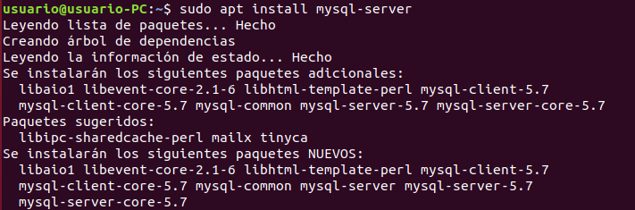

# Tarefa 2

La última versión de MySQL es la **5.7.29**. Podemos encontrarla en el repositorio del paquete APT.   
Antes de empezar la instalación hay que actualizar la lista de paquetes disponibles con el comando:   
 > $ sudo apt update      
      
     
       
Una vez actualizado, ya podemos proceder a la instalación de MySQL con el comando:   
 > $ sudo apt install mysql-server     
    
    
     
En caso de que algo saliera mal durante la instalación, tendríamos que cancelar la actual y volver a instalarlo utilizando el comando anterior.   
Cuando ya finaliza la intalación, ya tenemos nuestro servidor instalado y podemos comprobar su estado con el comando:    
 > system status mysql.service     
Para saber que está en funcionamiento debería aparecer así:  
   
   
   
Ahora que ya hemos comprobado que funciona correctamente, vamos a ejecutar un comando para tener un ejemplo, pero antes de poder ejecutar alguna isntrucción de MySQL, tenemos que ejecutar el comando **sudo mysql**:   
   
   
   
En otros documentos de este repositorio se verá la realización de bases de datos desde cero.
